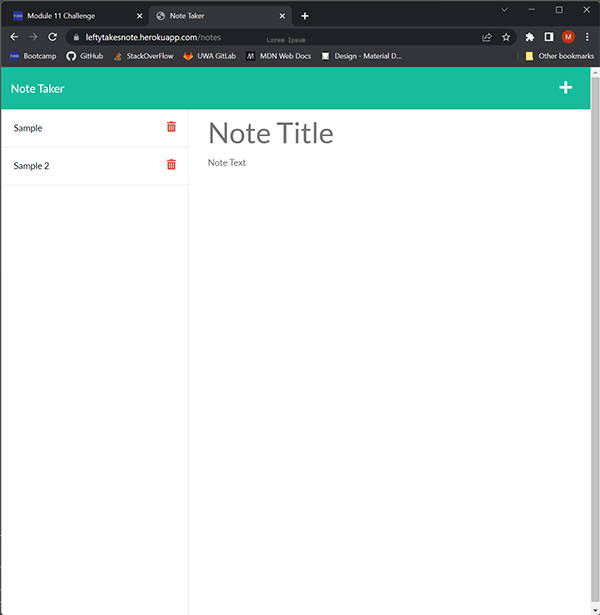

  
  # TakeNote Note Taker
  
  ## Table of Contents
  * [Description](#description)
  * [Technologies](#technologies)
  * [Installation](#installation)
  * [Usage](#usage)
  * [Contributing](#contributing)
  * [Guidelines](#guidelines)
  * [Tests](#tests)
  * [License](#license)
  * [Questions](#questions)
---

  ## Description
  This is an application designed to make taking and organising notes simple and efficient. When the user visits the index page they are greeted and presented with a button, that when clicked will take them to a seperate notes.html page where the user can(if applicable) view existing notes, where they can either delete or update them. The user can also create a new note on the same page which will then be added to the existing list.

  ## Technologies
  * HTML
  * CSS
  * Bootstrap
  * JavaScript
  * node.js
  

  ## Installation
   No installation required, visit the URL to use.

  ## Usage
   Application can be used [here](https://leftytakesnote.herokuapp.com/).

  ## Contributing
   Reach out through the email listed below.

  ## Guidelines
   Can be used for shopping lists, random thoughts etc.

  ## Tests
   Tests run in development.

  ## License
   Licensed under [MIT](https://opensource.org/licenses/MIT) 

   ---

  ## Questions
   For any questions you can find me at [GitHub](https://github.com/mleftwich) or email me at [mleftwich@live.com](mailto:mleftwich@live.com) 
